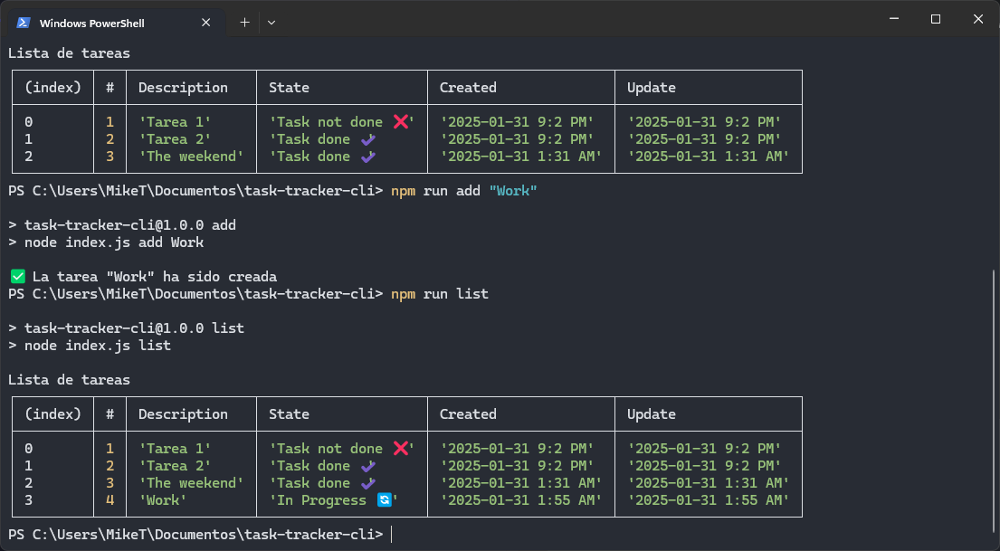

## Description

Task tracker cli is a project used to track and manage your tasks. In this task, you will build a simple command line interface (CLI) to track what you need to do, what you have done, and what you are currently working on. This project will help you practice your programming skills, including working with the filesystem, handling user inputs, and building a simple CLI application.

## Table of Contents

- [Project link](#project-link)
- [Requirements](#requirements)
- [Task Properties](#task-properties)
- [Commands](#commands)
- [Usage](#usage)
- [Screenshots](#screenshots)
- [Contact](#contact)

## Project link
- https://roadmap.sh/projects/task-tracker

## Requirements

The application should run from the command line, accept user actions and inputs as arguments, and store the tasks in a JSON file. The user should be able to:

- Add, Update, and Delete tasks
- Mark a task as in progress or done
- List all tasks
- List all tasks that are done
- List all tasks that are not done
- List all tasks that are in progress

Here are some constraints to guide the implementation:

- You can use any programming language to build this project.
- Use positional arguments in command line to accept user inputs.
- Use a JSON file to store the tasks in the current directory.
- The JSON file should be created if it does not exist.
- Use the native file system module of your programming language to interact with the JSON file.
- Do not use any external libraries or frameworks to build this project.
- Ensure to handle errors and edge cases gracefully.

## Task Properties

Each task should have the following properties:

- `id`: A unique identifier for the task
- `description`: A short description of the task
- `status`: The status of the task (`todo`, `in-progress`, `done`)
- `createdAt`: The date and time when the task was created
- `updatedAt`: The date and time when the task was last updated

## Commands

The commands are executed from the CLI with `npm run` or `yarn dev` with one of the following arguments that takes

- `add`: Add a task
- `edit`: Edit a task <task_id>
- `delete`: Delete a task <task_id>
- `complete`: Mark a task as completed <task_id>
- `not-complete`: Mark a task as not completed <task_id>
- `list`: List the tasks there are
- `list-progress`: List tasks in progress
- `list-not-done`: List tasks not completed
- `list-done`: List completed tasks
- `help`: Show command help box

## Usage

Here are the basic commands to use the CLI Task Manager Tool:

```bash
    npm run add "The weekend"
    npm run edit <task_id> "Argument"
    npm run delete <task_id>
    npm run complete <task_id>
    npm run not-complete <task_id>
    npm run help
```

## Screenshots



## Contact

If you have any questions or suggestions, feel free to contact us:

- Author name: [Erick Gonzalez](https://github.com/muke78)
- Email : <erickm.gonzalez.rivera@gmail.com>
